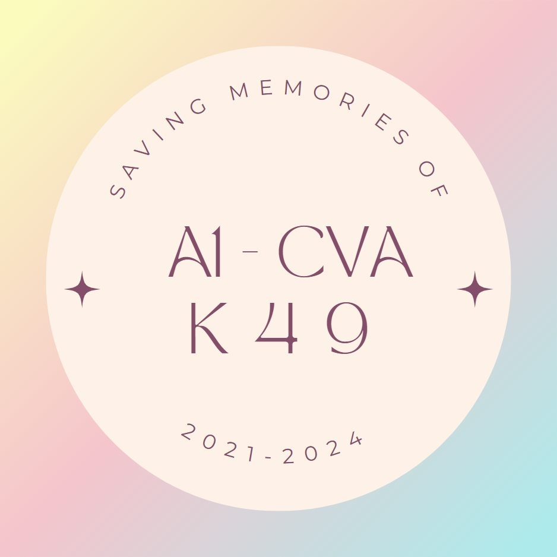

  

<h1 align="center">🌷 Sổ lưu bút 20/10 · Lớp 12A1</h1>

<i>Một món quà nhỏ dành riêng cho bạn.</i>

---

Ngày 20/10 năm nào cũng có hoa, có bánh, và một câu "chúc các bạn nữ luôn xinh
đẹp" đọc chung cho cả lớp. Năm nay các bạn nam lớp 12A1 muốn làm khác đi một
chút: **mỗi bạn nữ có một trang quà của riêng mình** — như cuốn sổ lưu bút thời
đi học, có ảnh, có thư của bạn bè, có cả chỗ ngồi quen thuộc trong lớp — và nó
chỉ mở ra đúng vào ngày 20/10.

## ✉️ Mở quà như thế nào

1. Vào trang, chọn **"Mình là thành viên trong lớp"** rồi gõ tên. Lười gõ? Bấm
   **✨ Face ID** và nhìn vào camera — *Mắt thần 20/10* nhận ra cậu trong vài
   giây, hỏi lại *"Có phải cậu là …? 🌸"* cho chắc rồi mới mở.
2. **Sơ đồ lớp sáng lên đúng chỗ cậu ngồi**, một lá thư bay ra từ bàn của cậu,
   rơi vào phong bì giữa màn hình rồi mở ra.
3. **Trang quà hiện ra:** lời giới thiệu viết riêng cho cậu, những tấm polaroid
   dán băng keo, thư các bạn gửi — thư ký tên có, thư ẩn danh cũng có — một lời
   chúc AI viết theo tên cậu, và một bản nhạc để bật lên khi muốn. Đọc xong thì
   thả cảm xúc cho từng lá thư 😍

Trước ngày 20/10, bấm vào trang quà chỉ thấy *"Chưa đến ngày 20/10"* — bất ngờ
thì phải giữ tới đúng ngày.

## 💌 Dành cho người gửi

- **Các bạn nam** (và bất kỳ ai quý lớp mình) viết thư từ trước: kèm một tấm
  ảnh, ký tên hay ẩn danh tùy thích, hẹn giờ cho lá thư tự hiện ra lúc nửa đêm
  20/10 cũng được. Thư "dán tem" xong là vào hộp, chờ duyệt rồi nằm yên trong
  trang quà của người nhận.
- **Muốn chúc một người ngoài lớp?** Cứ gửi — trang tự làm cho người đó một góc
  riêng; họ chọn "Mình là khách ghé thăm", tìm tên mình là thấy.
- **Khách ghé thăm** không có tên trong danh sách cũng không về tay không: gõ tên
  là nhận một lời chúc 20/10 dành riêng cho mình.

## 🌸 Những điều nhỏ mà có ý

- **Làm như sổ lưu bút thật:** giấy kem, tem và dấu bưu điện, polaroid dán băng
  keo, thư kẻ dòng, vài cánh hoa rơi. Nhạc không tự bật — ai muốn nghe thì bấm.
- **Máy cũng biết nói đùa:** Face ID mà chưa nhận ra thì nó bảo *"Hôm nay cậu
  xinh quá, mình nhận không ra 😅"* rồi mời gõ tên, không bắt ai đứng chờ.
- **Riêng tư cũng là một phần của quà:** camera chỉ dùng để so khớp ngay lúc đó
  rồi bỏ — không ảnh, không video nào được lưu. Hồ sơ khuôn mặt chỉ là một dãy
  số, không phải tấm ảnh.
- **Cả lớp mở cùng lúc cũng không sao:** đã thử 40 người quét mặt cùng một lúc —
  không ai bị bỏ lại phía sau.

## 💭 Vì sao có trang này

Lời chúc 20/10 thường được đọc một lần rồi trôi mất trong nhóm chat. Một trang
quà thì ở lại. Vài năm nữa mở ra, vẫn thấy ảnh lớp, thấy chỗ mình từng ngồi, đọc
lại những lời bạn bè viết cho mình thời 12A1. Tụi mình muốn tặng các bạn nữ
không chỉ một lời chúc, mà một góc kỷ niệm của riêng từng người.

## 🗓️ Các phiên bản

- **v1.1.0 — Mắt thần 20/10:** mở quà bằng khuôn mặt; admin xem được lịch sử
  từng lượt quét để Face ID ngày càng nhận đúng hơn.
- **v1.0.0 — Sổ lưu bút:** trang quà riêng cho từng bạn, thư bay ra từ chỗ ngồi,
  gửi lời chúc kèm ảnh, khoá chờ tới ngày 20/10.

---

  Làm với rất nhiều thương mến dành cho các bạn nữ lớp 12A1 🌷 
  Muốn chạy, sửa hay vận hành trang? Phần kỹ thuật nằm trong <a href="HUONG_DAN.md">HUONG_DAN.md</a>.

